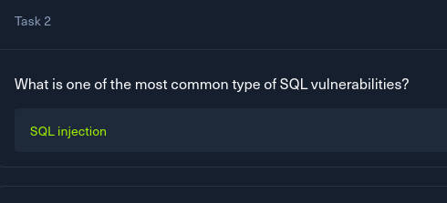
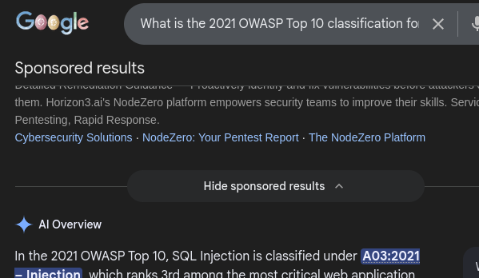
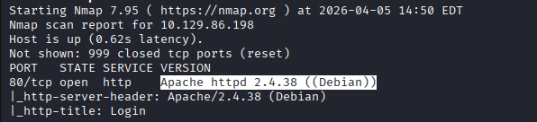
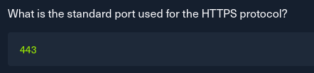
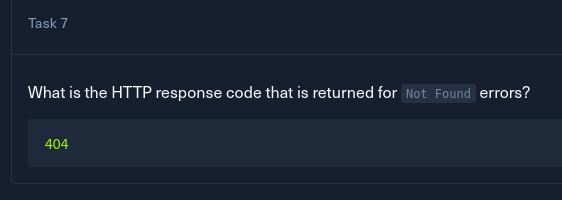
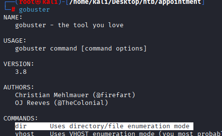
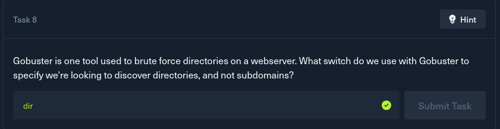
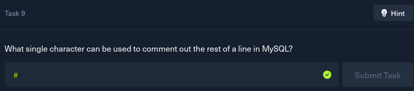

# HTB Appointment — Writeup

---

##  Overview

* **Machine Name:** Appointment
* **Difficulty:** Easy
* **Category:** Web Exploitation
* **Objective:** Exploit SQL Injection vulnerability to bypass authentication and retrieve the user flag

---

##  Attack Flow Summary

```
Recon → Web Login Page → SQL Injection → Auth Bypass → Flag Retrieval
```

---

##  Tools Used

* Browser
* Burp Suite (optional)
* SQL Injection payloads

---

##  MITRE ATT&CK Mapping

| Phase             | Technique                                 |
| ----------------- | ----------------------------------------- |
| Initial Access    | T1190 - Exploit Public-Facing Application |
| Execution         | T1059 - Command & Scripting Interpreter   |
| Credential Access | T1552 - Unsecured Credentials             |

---

#  Step-by-Step Exploitation

---

## 🔎 Step 1: Initial Enumeration

Access the target IP in the browser.


```md


```

---

##  Step 2: Identify Entry Point

The login form is the **primary attack surface**.


```md

```

---

##  Step 3: Test for SQL Injection

Try basic payload:

```
' OR '1'='1
```


```md

```

---

##  Step 4: Authentication Bypass

Use payload in login:

* **Username:**

```
admin' --
```

* **Password:**

```
(anything or blank)
```


```md

```

---

##  Step 5: Successful Login


```md

```

---

##  Step 6: Locate the Flag


```md

```

---

##  Step 7: Additional Observations


```md

```

---

##  Step 8


```md

```

---

##  Step 9

```md

```

---

##  Step 10


```md

```

---

##  Step 11


```md

```

---

##  Step 12


```md

```

---

## Step 13


```md

```

---

## Final Flag

```

```

---

# 🔑 Key Findings

* Login form vulnerable to **SQL Injection**
* No input sanitization
* Authentication bypass achieved

---

# 📚 Lessons Learned

* Always sanitize user input
* Use prepared statements
* Avoid direct query execution

---

# 🏁 Conclusion

A simple SQL injection payload:

```
admin' --
```

was enough to bypass authentication and retrieve the flag.

---

