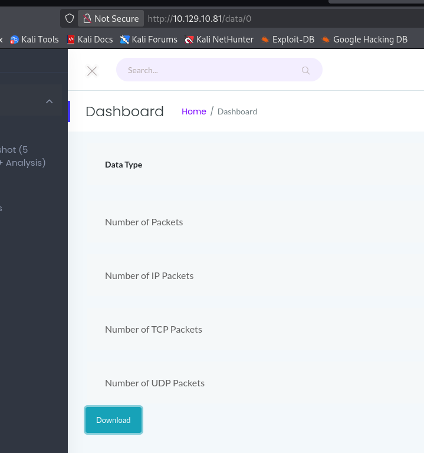

# Cap - Network Traffic Analysis (CTF Writeup)

## 🧠 Overview
This challenge focuses on analyzing network traffic captures to identify sensitive information exposure, insecure services, and potential vulnerabilities.

Through multiple tasks, we investigate HTTP requests, FTP traffic, and system processes to extract meaningful insights from captured data.

---

## 🎯 Objectives
- Analyze captured network traffic
- Identify sensitive data exposure
- Investigate insecure protocols (FTP, HTTP)
- Extract hidden information from PCAP files

---

## 🛠️ Tools Used
- Wireshark
- tcpdump
- Browser DevTools
- FTP stream analysis

---

## 🔍 Image Breakdown

---

### ✅ Image 2
**Question:** What is the data returned from the endpoint?

**Answer:** `data`

📸 Evidence:

---

### ✅ Image 3
**Question:** Is the endpoint vulnerable?

**Answer:** `Yes`

📸 Evidence:

---

### ✅ Image 4
**Question:** What ID returns valid data?

**Answer:** `0`

📸 Evidence:

---

### ✅ Image 5
**Question:** What protocol is being used to transfer sensitive data?

**Approach:**
- Downloaded PCAP file using ID = 0
- Opened in Wireshark
- Followed TCP stream
- Identified credentials in FTP traffic

**Answer:** `FTP`

📸 Evidence:

---

### ✅ Image 6
**Question:** Which service is exposed?

**Answer:** `ssh`

📸 Evidence:

---

### ✅ Image 8
**Question:** What binary is used?

**Answer:** `/usr/bin/python3.8`

📸 Evidence:

---

### ❓ Image 9
📸 Evidence:

> ⚠️ Final answer missing — needs verification from screenshot

---

## 🚨 Key Findings

- **IDOR Vulnerability**: Changing ID parameter exposes sensitive data
- **Insecure Protocol Usage**: FTP used for credential transfer (plaintext)
- **Sensitive Data Exposure**: PCAP files accessible without proper authentication
- **Service Enumeration**: SSH service identified on target system

---

## 📚 Lessons Learned

- Always validate access control for API endpoints
- Avoid using insecure protocols like FTP
- Network traffic analysis can reveal critical security flaws
- PCAP files can leak credentials if not properly secured

---

## 📌 Conclusion

This challenge demonstrates how improper access control and insecure communication protocols can lead to critical data exposure. By leveraging network traffic analysis, we were able to extract sensitive information and identify multiple security weaknesses.

---

## 👤 Author
**Aaradhya Desai**  
Cybersecurity | Network Security | Offensive Security  
