# Cap - Network Traffic Analysis (CTF Writeup)

##Summary of the hack available on Mediuam:** https://medium.com/@aaradhyadesai/hack-the-box-cap-writeup-exploiting-idor-to-gain-ssh-access-full-walkthrough-d31f849b9012

##  Overview
This challenge focuses on analyzing network traffic captures to identify sensitive information exposure, insecure services, and potential vulnerabilities.

Through multiple tasks, we investigate HTTP requests, FTP traffic, and system processes to extract meaningful insights from captured data.

---

##  Objectives
- Analyze captured network traffic
- Identify sensitive data exposure
- Investigate insecure protocols (FTP, HTTP)
- Extract hidden information from PCAP files

---

##  Tools Used
- Wireshark
- tcpdump
- Browser DevTools
- FTP stream analysis

---
**Question 1:** How many TCP ports are open?

**Answer** `3`

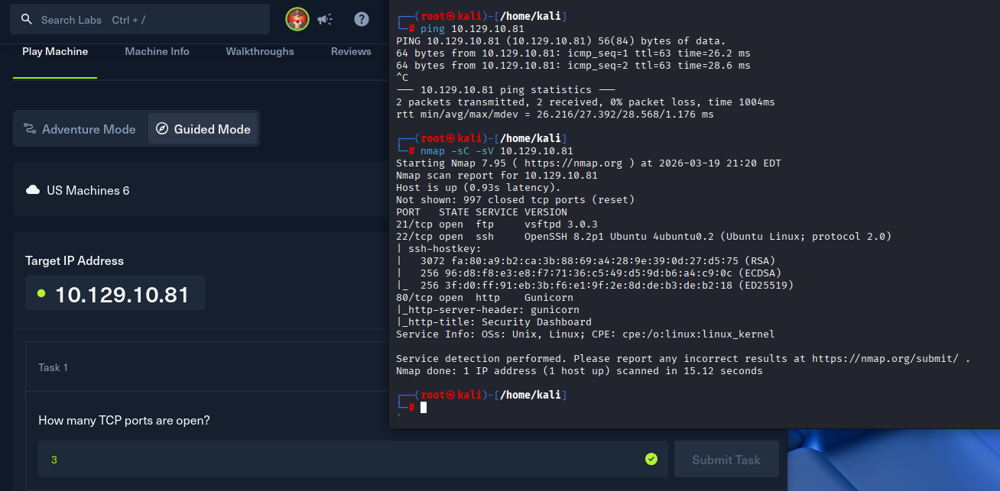

---

**Question 2:** After running a "Security Snapshot", the browser is redirected to a path of the format /[something]/[id], where [id] represents the id number of the scan. What is the [something]?

**Answer:** `data`

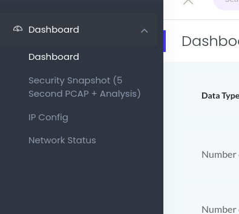

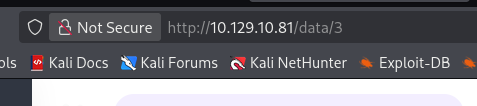

---

**Question 3:** Are you able to get to other users' scans?

**Answer:** `Yes`

 
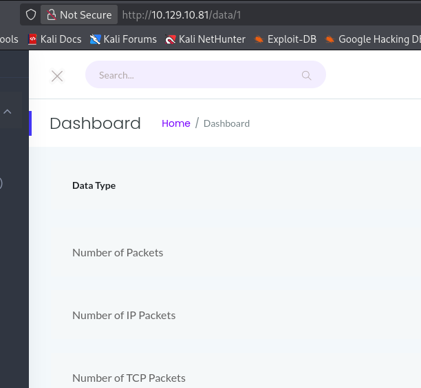

---

**Question 4:**What is the ID of the PCAP file that contains sensative data?

**Answer:** `0`

 
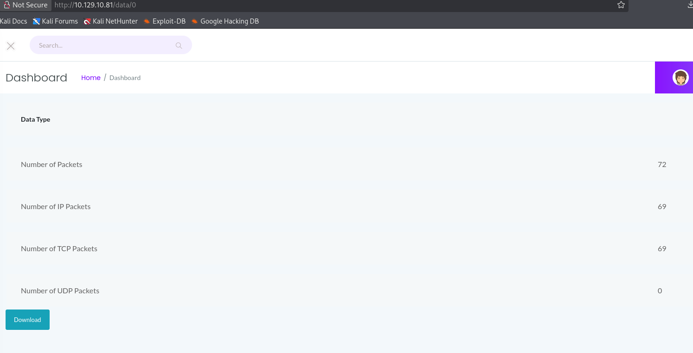

---

**Question 5:** Which application layer protocol in the pcap file can the sensetive data be found in?

**Approach:**
- Downloaded PCAP file using ID = 0
- Opened in Wireshark
- Followed TCP stream
- Identified credentials in FTP traffic

**Answer:** `FTP`

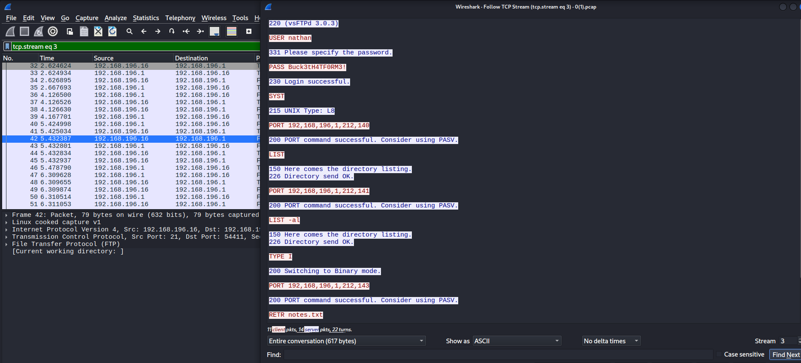

**Question 6:** We've managed to collect nathan's FTP password. On what other service does this password work?

We found that ssh is also open when we performed an nmap scan.
*Password*: Buck3tH4TF0RM3

**Answer:** `ssh`

 
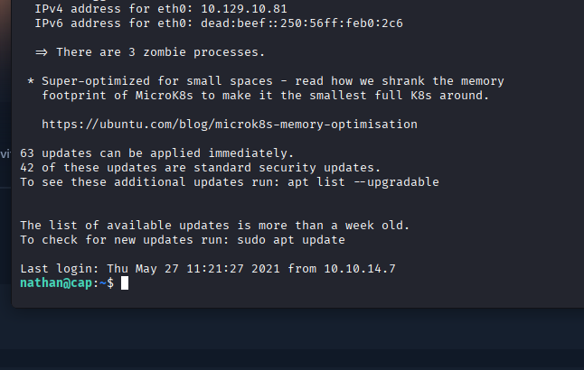

---

**Question 7:**Submit the flag located in the nathan user's home directory.

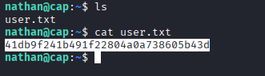

---

**Question 8:** What is the full path to the binary on this machine has special capabilities that can be abused to obtain root privileges?

**Answer:** `/usr/bin/python3.8`

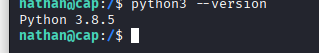
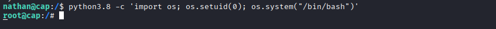

---
**Question 9:** Submit the flag located in root's home directory.

**Answer:** `a958f3e24723aa273fc02012a1796358`

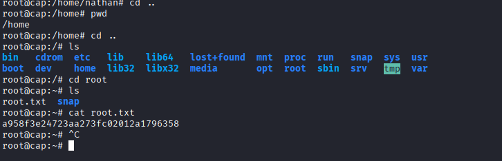

> 

---

##  Key Findings

- **IDOR Vulnerability**: Changing ID parameter exposes sensitive data
- **Insecure Protocol Usage**: FTP used for credential transfer (plaintext)
- **Sensitive Data Exposure**: PCAP files accessible without proper authentication
- **Service Enumeration**: SSH service identified on target system

---

##  Lessons Learned

- Always validate access control for API endpoints
- Avoid using insecure protocols like FTP
- Network traffic analysis can reveal critical security flaws
- PCAP files can leak credentials if not properly secured

---

##  Conclusion

This challenge demonstrates how improper access control and insecure communication protocols can lead to critical data exposure. By leveraging network traffic analysis, we were able to extract sensitive information and identify multiple security weaknesses.

---

##  Author
**Aaradhya Desai**  
Cybersecurity | Network Security | Offensive Security  
